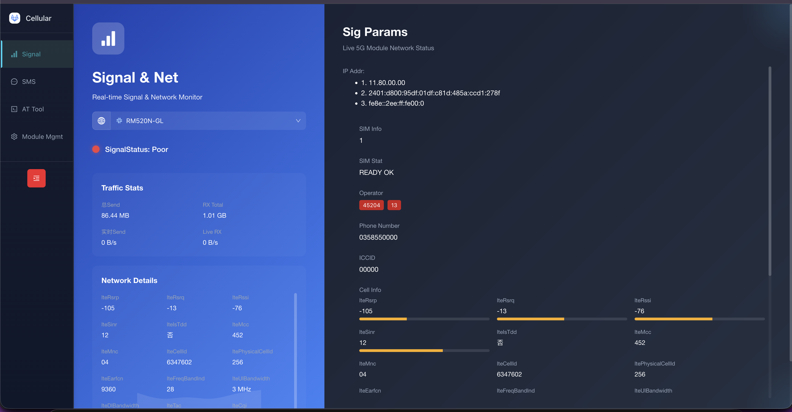

# H29K 5G CPE — English UI

<p align="center">
  
</p>

This repository contains the OpenWrt integration files and English-patched `modemserver` binary for the **H29K 5G CPE** (Customer Premises Equipment) router.

The stock `modemserver` binary ships with a Chinese-language Vite/React web UI. This project patches all embedded Chinese strings to English and wires the UI into OpenWrt's LuCI admin panel.

> **Buy the H29K device:** [Taobao listing](https://item.taobao.com/item.htm?id=896391872170)



---

## Files

| File | Description |
|------|-------------|
| `modemserver` | Original binary (Chinese UI) |
| `modemserver_en` | **English-patched binary** — deploy this one |
| `patch_binary.py` | Python script that generates `modemserver_en` from `modemserver` |
| `modemserver.lua` | LuCI controller — registers the modem page in OpenWrt admin |
| `5Gmodem.htm` | LuCI view template — main modem page (embeds modemserver UI) |
| `5Gmodeminfo.htm` | LuCI view template — detailed modem info page |
| `H29K-Boot-Loader.bin` | H29K bootloader binary |

> **Firmware image** (`OP-H29K-NEW-UI-*.img`) is not included in this repo due to size.

---

## Installation on OpenWrt

Copy each file to the correct path on the router via `scp` or a USB drive.

### 1. Deploy the English modemserver binary

```sh
scp modemserver_en root@192.168.1.1:/usr/bin/modemserver
ssh root@192.168.1.1 "chmod +x /usr/bin/modemserver && /etc/init.d/modemserver restart"
```

### 2. Deploy LuCI controller

```sh
scp modemserver.lua root@192.168.1.1:/usr/lib/lua/luci/controller/modemserver.lua
```

### 3. Deploy LuCI view templates

```sh
scp 5Gmodem.htm     root@192.168.1.1:/usr/lib/lua/luci/view/modemserver/5Gmodem.htm
scp 5Gmodeminfo.htm root@192.168.1.1:/usr/lib/lua/luci/view/modemserver/5Gmodeminfo.htm
```

### 4. Clear LuCI cache and restart

```sh
ssh root@192.168.1.1 "rm -rf /tmp/luci-*; /etc/init.d/uhttpd restart"
```

### 5. Access the UI

Open your browser and navigate to:

```
http://192.168.1.1/cgi-bin/luci/admin/modemserver
```

Log in with your OpenWrt admin credentials. The **Cellular Module** menu entry will appear in the navigation sidebar.

---

## File Locations on OpenWrt

| File | Path on OpenWrt |
|------|----------------|
| `modemserver_en` | `/usr/bin/modemserver` |
| `modemserver.lua` | `/usr/lib/lua/luci/controller/modemserver.lua` |
| `5Gmodem.htm` | `/usr/lib/lua/luci/view/modemserver/5Gmodem.htm` |
| `5Gmodeminfo.htm` | `/usr/lib/lua/luci/view/modemserver/5Gmodeminfo.htm` |

---

## Rebuilding the English Binary

If `modemserver` is updated, regenerate the patched binary:

```sh
python3 patch_binary.py
# Output: modemserver_en
```

Requirements: Python 3.6+, no external dependencies.

The script finds all embedded Chinese UTF-8 strings in the binary (part of the Vite/React bundle) and overwrites them with English equivalents, padding with spaces to preserve byte offsets.

---

## Features of the Modem UI

- **Cellular** — Live signal stats (RSRP, RSRQ, RSSI, SINR), cell info, network type
- **5G Module Mgr** — Module configuration, APN settings, dial mode, IPv6, DNS
- **AT Tool** — Serial AT command console with common command presets (Quectel, Fibocom, Foxconn, Meig)
- **SMS Manager** — Inbox/outbox, send messages, SMS forwarding to phone
- **Cell & Band Ctrl** — Lock/unlock specific cells and frequency bands
- **Traffic Stats** — Network throughput counters
- **Live Monitor** — Real-time signal and network parameter monitoring

---

## Compatibility

Tested on:
- **Device**: H29K 5G CPE
- **OS**: OpenWrt
- **Modem chipset**: Qualcomm-based 5G modules (Quectel, Fibocom, Foxconn, Meig)
